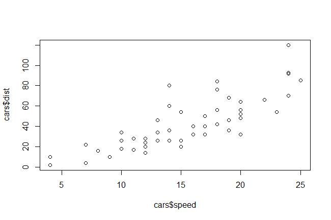

D607_P03_presentation_DRAFT
What are the most valued data science skills?
========================================================
author: Bar Raisers - Large Group Justified
date: 
autosize: true

Team: Bar Raisers - Large Group Justified
========================================================

For more details on authoring R presentations please visit <https://support.rstudio.com/hc/en-us/articles/200486468>.

-	Bharani Nittala
-	Richard Sughrue
-	LeTicia Cancel
-	George Cruz Deschamps
-	Jack Wright

Misc Notes:
========================================================
- RSelenium Server
- show libraries used in code = {r}


Agenda 
========================================================

- What are the most valued data science skills?
- CIO Perspective
- Webscraping from Social Media Sources
- Tidying, Transforming, and Storage 
- Exploratory Data Analysis
- Key Themes from Social Media Sources
- Summary
- Future Exploratory Data Analysis Opportunities
- Questions


What are the most valued data science skills?
========================================================

This project  used an exploratory data analysis approach to obtain
 information available in the public domain from leading social media websites to answer this question.

Websites used:
- [LinkedIn](https://www.linkedin.com/)
- [Twitter](https://twitter.com/)
- [Amazon Jobs](https://www.amazon.jobs/en/)
- [Glassdoor](https://www.glassdoor.com/index.htm)

CIO Magazine - Bob Violino, Contributing Writer & CIO says ...
========================================================

Essential skills and traits of elite data scientists are - 
- Critical thinking
- Coding
- Math
- Machine learning, deep learning, AI
- Communication
- Data architecture
- Risk analysis, process improvement, systems engineering
- Problem solving and good business intuition

Reference:
[Violino, B. (2018, Mar 27). Essential skills and traits of elite data scientists. CIO Magazine] (https://www.cio.com/article/3263790/the-essential-skills-and-traits-of-an-expert-data-scientist.html)


Data Extraction through Web Scraping Methods
========================================================

- Sources: LinkedIn, Twitter, Amazon Jobs, Glassdoor
- Searched datasets for "Data Science"
- R Packages used: tidyvest, rvest, httr, jsonlite [name others]
- GadgetSelector


```r
# put excerpts of code here
library(ggplot2)
plot(cars$speed,cars$dist)
```

Tidying, Transforming, and Storage 
========================================================

- write tools used
- R Packages employed:
- Methods of Tidying & Transforming [elaborate]
- Quanteda

- Data Storage using [Amazon Web Services Relational Database Service (RDS)]  (https://aws.amazon.com/rds/?did=ft_card&trk=ft_card) using MySQL


```r
# put excerpts quanteda
```


Exploratory Data Analysis Methods
========================================================

quanteda: Quantitative Analysis of Textual Data <https://cran.r-project.org/package=quanteda>

Takes "text mining" to the next level

Explain high level tasks performed here - initial observations/impressions

Then go into each visualization separately


Sample Visualization(s) - using exported plots
========================================================



- time frame represented in extraction:
- other points


Sample Visualization(s) - 2 cols using exported plots
========================================================

First column
-some text here
-some more text
***
Second column
-some point


- time frame represented in extraction:
- other points


Visualization(s) - Twitter
========================================================

- time frame represented in extraction snap shot of mose recent 1,000 tweets
- ranked bar graphs of #hashtags embedded within "w/"DataScience" tweets


- Elaborate on key info features of EDA from Twitter
- 


```r
# put excerpts of code sets here -   
library(ggplot2)
plot(cars$speed,cars$dist)
```


Visualization(s) - LinkedIn
========================================================

- Wordcloud
- time frame represented in extraction:
- other points

- Elaborate on key info features of EDA from LinkedIn


```r
# put excerpts of code sets here
```


Visualization(s) - Salary ranges GlassDoor
========================================================

- time frame represented in extraction:
- other points

- Elaborate on key info features of EDA from GlassDoor


```r
# put excerpts of code sets here
```


Visualization(s) - Amazon Jobs in Data Science
========================================================


- time frame represented in extraction:
- other points

- Elaborate on key info features of EDA from Amazon Jobs


```r
# put excerpts of code sets here
```


Visualization(s) - R versus Python 
========================================================

According to Anand Rao, global artificial intelligence and innovation lead for data and analytics at consulting firm PwC (Violino, 2018):

> *"language of choice in data science is moving towards Python, with a substantial following for R as well"*

The evidence from the following graph affirms this point.

- put ti


```r
# put excerpts of code sets here
```

Visualization(s) - Data Scientist Internships
========================================================

One observation from data extraction is the number of Data Scientist Internship positions with:
- Spotify
- CVS Health
- others identified in LinkedIn extraction
- Amazon Jobs list ??


```r
# put excerpts of code sets here
```

Summary
========================================================
So What are the most valued data science skills?

[Pick following from Violino's list affirming points in his 2018 article based on our EDA]
- Critical thinking
- Coding
- Math
- Machine learning, deep learning, AI
- Communication
- Data architecture
- Risk analysis, process improvement, systems engineering
- Problem solving and good business intuition


```r
# put excerpts of code sets here for WordCloud
```

Future Exploratory Data Analysis Opportunities
========================================================

Enhancing this framework to consider questions such as:
- Increase in working remotely in DS as a result on COVID-19
- Association between level of compensation and years of experience / higher learning
- Influence of MOOC (Massive Open Online Courses) with increasing learning opportunities
- YouTube as learning channels (> 100K DS videos loaded since beginning 2020!)
- Certain industries investing more heavily in DS?


Questions - 
========================================================

